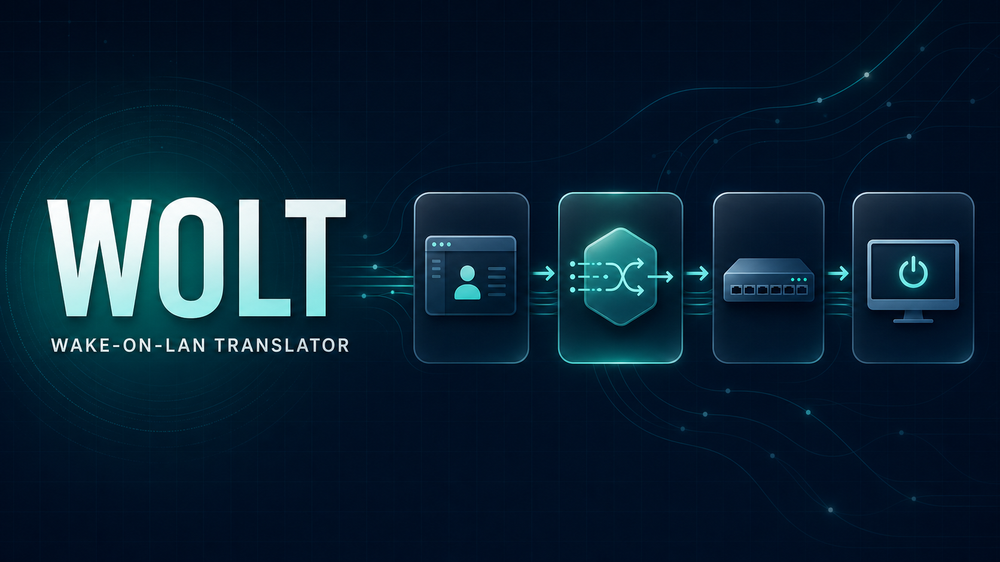

# WOLT — Wake-on-LAN Translator

## One-line installation

```bash
curl -fsSL https://raw.githubusercontent.com/AlirezaSayyari/WOLT/main/install.sh | sudo bash
```

<p align="center">
  
</p>

[](https://github.com/AlirezaSayyari/WOLT/actions/workflows/ci.yml)
[](https://hub.docker.com/r/alirezasayyari/wolt)
[](LICENSE)
[](https://hub.docker.com/r/alirezasayyari/wolt/tags)

Translate standard Wake-on-LAN magic packets from Guacamole or another PAM system into native edge-device wake commands.

The interactive installer securely collects the FortiGate connection, allowed Guacamole source IP, and first listener mapping; pins the SSH host key; pulls the published image; and starts WOLT. Docker Engine, Docker Compose v2, Git, and `ssh-keyscan` must already be installed.

> Current stable image: `alirezasayyari/wolt:0.1.0`

---

## What WOLT solves

Guacamole can send a standard Wake-on-LAN magic packet, but the target workstation may sit behind a routed VLAN where a local broadcast is unavailable. WOLT acts as a small, controlled translation boundary:

- receives the packet on a listener-specific UDP port;
- permits traffic only from the configured Guacamole/guacd source IP;
- validates the exact 102-byte magic-packet structure;
- extracts and validates the destination MAC address;
- maps the listener port to an edge interface and gateway/broadcast address;
- rate-limits repeated wake requests;
- executes the native wake command through a pinned SSH connection;
- emits structured operational logs without logging passwords or packet contents.

The current `v0.1.x` release is a tested headless MVP with a built-in FortiGate SSH adapter. The architecture is intentionally designed for additional edge-device providers and a management web interface in later releases.

## Architecture

```mermaid
flowchart LR
    PAM["PAM / Guacamole<br/>Wake request"]
    UDP["WOLT UDP ingress<br/>Dedicated listener port"]
    VALIDATE["Source allow-list<br/>Magic-packet validation"]
    LIMIT["Per-port + MAC<br/>rate limiter"]
    MAP["Port mapping<br/>interface + gateway"]
    DRIVER["Edge-device adapter<br/>FortiGate SSH in v0.1"]
    EDGE["FortiGate<br/>native WOL command"]
    LAN["Destination VLAN<br/>target workstation"]
    LOGS[("Structured logs")]

    PAM -->|"UDP magic packet"| UDP
    UDP --> VALIDATE
    VALIDATE --> LIMIT
    LIMIT --> MAP
    MAP --> DRIVER
    DRIVER -->|"Pinned SSH host key"| EDGE
    EDGE -->|"LAN broadcast"| LAN

    VALIDATE -.-> LOGS
    LIMIT -.-> LOGS
    DRIVER -.-> LOGS

    classDef source fill:#ecfdf5,stroke:#14b8a6,color:#0f172a
    classDef core fill:#0f172a,stroke:#2dd4bf,color:#f8fafc
    classDef edge fill:#eff6ff,stroke:#3b82f6,color:#0f172a
    class PAM,LAN source
    class UDP,VALIDATE,LIMIT,MAP,DRIVER core
    class EDGE edge
```



### Port-to-interface contract

The UDP destination port is a mapping identifier. It is never copied into the FortiGate command.

| Incoming request | WOLT mapping | Native action |
| --- | --- | --- |
| `WOLT_HOST:40016` | `demo-vlan-16` + `198.51.100.94` | Wake the parsed MAC on the mapped LAN |
| `WOLT_HOST:40067` | `demo-vlan-67` + `203.0.113.30` | Wake the parsed MAC on the mapped LAN |

This convention lets a PAM connection select the destination network by using a dedicated UDP port while remaining unaware of the edge-device CLI.

## Security model

- The container runs as the non-root user `wolt` with UID/GID `10001`.
- The FortiGate account should be restricted to its assigned VDOM and the required wake command.
- WOLT uses a direct SSH `exec_command`; it does not open an interactive shell.
- `config vdom`, `edit`, and `end` are not sent because the service account is already scoped to its working VDOM.
- Unknown or changed SSH host keys are rejected.
- SSH agent forwarding and discovery of arbitrary client keys are disabled.
- `.env`, live mappings, and `known_hosts` are excluded from Git.
- Passwords, complete payloads, and environment dumps are never logged.
- A malformed packet or failed SSH request does not terminate its listener.

## Requirements

- Linux host with Docker Engine and Docker Compose v2
- Network access from the host to FortiGate SSH
- UDP access from Guacamole/guacd to the selected WOLT listener ports
- FortiGate service account with least-privilege access to the required VDOM
- OpenSSH client utilities for `ssh-keyscan`

Published images support `linux/amd64` and `linux/arm64`.

## Manual Docker installation

Use this path when you want to review or customize every file instead of using the interactive installer.

```bash
git clone https://github.com/AlirezaSayyari/WOLT.git
cd WOLT
cp .env.example .env
cp config/interfaces.example.yaml config/interfaces.yaml
mkdir -p ssh
ssh-keyscan -T 5 -p 22 192.0.2.30 > ssh/known_hosts
chmod 600 .env ssh/known_hosts
```

Edit `.env` and `config/interfaces.yaml`, then start the published release:

```bash
WOLT_IMAGE=alirezasayyari/wolt:0.1.0 \
docker compose -f docker-compose.yml -f compose.release.yml up -d
```

To build from the local source instead:

```bash
docker compose up -d --build
```

## Configuration

### Environment variables

| Variable | Required | Default | Description |
| --- | ---: | --- | --- |
| `FORTIGATE_HOST` | Yes | — | FortiGate hostname or IP address |
| `FORTIGATE_SSH_PORT` | No | `22` | FortiGate SSH port |
| `FORTIGATE_USERNAME` | Yes | — | Restricted FortiGate service account |
| `FORTIGATE_PASSWORD` | Yes | — | Service-account password; keep outside Git |
| `GUACAMOLE_ALLOWED_IP` | Yes | — | Only source IP permitted to send packets |
| `SSH_CONNECT_TIMEOUT` | No | `5` | SSH connection timeout in seconds |
| `SSH_COMMAND_TIMEOUT` | No | `10` | Native command timeout in seconds |
| `WOL_RATE_LIMIT_SECONDS` | No | `30` | Per-listener and destination-MAC cooldown |
| `LOG_LEVEL` | No | `INFO` | Python logging level |
| `MAPPING_FILE` | No | `/app/config/interfaces.yaml` | Mapping file inside the container |
| `KNOWN_HOSTS_FILE` | No | `/home/wolt/.ssh/known_hosts` | Pinned SSH host-key file |

### Listener mappings

```yaml
listeners:
  "40016":
    interface: "demo-vlan-16"
    gateway_ip: "198.51.100.94"
  "40067":
    interface: "demo-vlan-67"
    gateway_ip: "203.0.113.30"
```

Rules:

- UDP ports must be unique and between `1024` and `65535`.
- Every mapping requires an interface and a valid IPv4 or IPv6 gateway/broadcast address.
- Interface values are strictly validated before they can reach the command builder.
- Empty, malformed, or duplicate mappings prevent startup instead of starting in an unsafe partial state.

## Guacamole configuration

For a connection assigned to listener `40016`:

```text
Wake-on-LAN MAC Address:       02:AA:BB:CC:DD:16
Wake-on-LAN Broadcast Address: <WOLT server IP>
Wake-on-LAN UDP Port:          40016
Wake-on-LAN Wait Time:         30
```

The Guacamole broadcast-address field points to the WOLT server. The random UDP source port is not trusted or validated; the guacd source IP must match `GUACAMOLE_ALLOWED_IP`.

## Operations

### Status and logs

```bash
docker compose ps
docker compose logs -f wolt
```

### Verify UDP listeners

```bash
sudo ss -lunp | grep -E '40016|40067'
```

### Capture incoming wake traffic

```bash
sudo tcpdump -ni any 'udp portrange 40000-40099' -s0 -vvv -XX
```

### Upgrade the published image

```bash
cd /opt/wolt
docker compose -f docker-compose.yml -f compose.release.yml pull
docker compose -f docker-compose.yml -f compose.release.yml up -d
```

## Event reference

| Event or reason | Meaning |
| --- | --- |
| `listener_started` | UDP listener successfully bound |
| `wol_request_received` | Valid packet received from the allowed source |
| `wol_request_rate_limited` | Repeated port/MAC request rejected during cooldown |
| `source_not_allowed` | Packet source does not match the configured guacd IP |
| `invalid_magic_packet` | Payload length, header, or repeated MAC pattern is invalid |
| `ssh_authentication_failed` | FortiGate rejected the configured credentials |
| `host_key_verification_failed` | FortiGate host key is unknown or changed |
| `ssh_timeout` | Connection or command exceeded its timeout |
| `command_failed` | FortiGate returned a non-zero command result |
| `fortigate_wol_success` | Native wake command completed successfully |

## Testing and development

Run the isolated container test target:

```bash
docker build --target test -t wolt:test .
docker run --rm wolt:test
```

Or use Python 3.12 locally:

```bash
python -m venv .venv
. .venv/bin/activate
pip install -r requirements-dev.txt
pytest -q
```

The CI workflow runs the tests, performs a production-image build, and scans the repository for committed secrets. Semantic version tags publish multi-architecture images with provenance and an SBOM.

## Roadmap

- Management UI with onboarding, mappings, devices, logs, and engine controls
- PostgreSQL reference deployment and optional SQL Server support
- Encrypted device and SMTP credentials
- Authentication, password recovery, and audit events
- Schema-driven edge-device providers beyond FortiGate
- Configurable UDP allocation range and persisted event dashboards

See [Product UX](docs/design/01-product-ux.md), [Technical Architecture](docs/design/02-architecture-erd.md), and [UI Design Specification](docs/design/03-ui-design-spec.md).

## Contributing

Read [CONTRIBUTING.md](CONTRIBUTING.md) before opening a pull request. Security issues must follow [SECURITY.md](SECURITY.md) and must not be reported with live credentials or internal network details.

## License

WOLT is released under the [MIT License](LICENSE).
