# WOLT — Wake-on-LAN Translator

## One-line installation

```bash
curl -fsSL https://github.com/AlirezaSayyari/WOLT/releases/latest/download/install.sh | sudo bash -s -- --install-dir /data/WOLT
```

<p align="center">
  
</p>

[](https://github.com/AlirezaSayyari/WOLT/actions/workflows/ci.yml)
[](https://hub.docker.com/r/alirezasayyari/wolt)
[](LICENSE)
[](https://hub.docker.com/r/alirezasayyari/wolt/tags)

Translate standard Wake-on-LAN magic packets from Guacamole or another PAM system into native edge-device wake commands.

The installer creates only the required runtime files under `/data/WOLT`; generates the
database, bootstrap, and encryption secrets locally; verifies and pins the signed image
digest; starts PostgreSQL and WOLT; and prints the one-time Owner setup token. It does not
clone the repository. Docker Engine, Docker Compose v2, curl, OpenSSL, Python 3, and
`sha256sum` must already be installed; the installer adds a checksum-verified Cosign binary
when needed.

> Current stable image: `alirezasayyari/wolt:v1.1.1` (also published as `1.1.1`, `1.1`, and `latest`)

---

## What WOLT solves

Guacamole can send a standard Wake-on-LAN magic packet, but the target workstation may sit behind a routed VLAN where a local broadcast is unavailable. WOLT acts as a small, controlled translation boundary:

- receives the packet on a listener-specific UDP port;
- permits traffic only from the configured Guacamole/guacd source IP;
- validates the exact 102-byte magic-packet structure;
- extracts and validates the destination MAC address;
- maps the listener port to an edge interface and gateway/broadcast address;
- rate-limits repeated wake requests;
- executes the native wake command through a pinned SSH connection;
- emits structured operational logs without logging passwords or packet contents.

WOLT v1.1 includes the Vue management UI, FastAPI API, PostgreSQL persistence,
encrypted device credentials, first-run Owner setup, role-based users, SMTP invitations
and recovery, listener management, live engine controls, event analytics, audit history,
and the optional restricted Host Agent. The driver contract remains extensible for
future edge-device providers.

## First startup

The one-line installer starts the digest-pinned published image. For local development from
a source checkout, build an image explicitly and then start it:

```bash
./scripts/init-web-env.sh
docker build --target production --build-arg WOLT_VERSION=v1.1.1-dev -t wolt:local .
WOLT_IMAGE=wolt:local docker compose --env-file .env.web -f compose.web.yml up -d --no-build
```

The initializer generates independent cryptographically random database and bootstrap
secrets, writes `.env.web` with mode `600`, refuses to overwrite an existing file,
and prints the first-run token with setup guidance. No manual secret editing is needed.

Open `http://WOLT_HOST:8080` and enter the printed bootstrap token to create the first Owner.
Save the one-time recovery code in a password manager. The application starts as non-root with a read-only
root filesystem, runs the initial migration, and keeps PostgreSQL on an internal
Docker network. The deployment envelope defaults to UDP `40000–40099`; its start and
end can be chosen in `.env.web` before container creation. Published and active ports
must remain between `1024` and `65535`, and a deployment range may contain at most 100
ports. The active allocation range can then be narrowed from the Settings page without
recreating the container.

### One-time migration from v1.0.x

An existing source-based installation can move to the minimal v1.1 runtime without losing
its environment, certificates, PostgreSQL volume, or Host Agent backups. Run this once from
any directory:

```bash
curl -fsSL https://github.com/AlirezaSayyari/WOLT/releases/download/v1.1.1/install.sh | \
  sudo bash -s -- --install-dir /data/WOLT --upgrade-existing
```

The migration first copies the existing managed runtime into
`/var/lib/wolt-agent/runtime-backups/`. Back up `.env.web` securely before and after the
migration. Losing `WOLT_MASTER_KEY` makes encrypted device credentials unrecoverable; the
key is deliberately not stored in PostgreSQL.

For an HTTPS deployment, set `WOLT_SESSION_SECURE=true`. `WOLT_SESSION_HOURS`
controls the server-side session lifetime and defaults to 12 hours. The bootstrap
token only authorizes creation of the first Owner; subsequent setup attempts are
rejected by the database-backed Owner invariant. The bootstrap token only needs to
remain private until Owner creation is complete. The Recovery Code shown in the UI is
the long-term secret that must be retained.

When adding a FortiGate in the web UI, enter its address and service-account credential,
then select **Discover key & test connection**. WOLT performs the SSH handshake from the
server, displays the SHA-256 fingerprint for operator confirmation, tests authentication,
and fills the pinned host-key automatically. The credential is never returned by the API
or included in the audit record.

After the first Owner is created, open **SMTP** to configure mail delivery and the public
HTTPS URL used in one-time links. Send a test message before enabling the configuration.
Then use **Users & sessions** to invite an Administrator or Operator; recipients set their
own password through a 24-hour single-use link. Email password recovery uses a 30-minute
single-use link and revokes all existing sessions. The original Owner offline recovery code
remains available when email is unavailable.

If the SMTP server uses a certificate issued by a private corporate CA, copy the CA/root
bundle in PEM format to `certs/smtp-ca.pem` and add this line to `.env.web`:

```dotenv
WOLT_SMTP_CA_FILE=/etc/wolt/certs/smtp-ca.pem
```

Then recreate only the application container:

```bash
docker compose --env-file .env.web -f compose.web.yml up -d --no-build --force-recreate app
```

Keep certificate verification enabled. Use the issuing root/intermediate CA bundle rather
than disabling TLS validation or permanently trusting a replaceable server leaf certificate.

For a deliberately plaintext, IP-restricted internal relay, select **None — trusted internal
relay** in the SMTP page. This works on any configured port, including 587, and performs no
TLS handshake or certificate validation. Credentials and message content are unencrypted in
this mode, so do not use it across untrusted or routed networks. Leaving the username blank
also skips SMTP authentication for relays that authorize the WOLT host by source IP. A
connector that advertises only NTLM/GSSAPI authentication is not made compatible merely by
disabling TLS; use an IP-authorized relay or a supported SMTP AUTH mechanism.

### Optional restricted Host Agent

The one-line installer installs the restricted Host Agent automatically. It manages UFW,
published UDP ports, signed upgrades, health verification, and rollback from the Owner UI.
For a source-development installation, install it manually with:

```bash
sudo ./scripts/install-host-agent.sh "$(pwd)"
```

For a published minimal installation under `/data/WOLT`, repair or reinstall the Host
Agent with:

```bash
sudo /data/WOLT/runtime/scripts/install-host-agent.sh /data/WOLT
```

This command preserves the existing Host Agent token, refreshes its systemd service, and
recreates the app container with the authenticated Unix-socket override.

The app container remains non-root and never receives the Docker socket. Communication uses
an authenticated, group-restricted Unix socket. Upgrade images are accepted only after Cosign
verifies the official WOLT GitHub release workflow, and the verified digest—not the mutable
tag—is deployed. See [Phase 7 Host Operations](docs/design/09-phase-7-host-operations.md)
before enabling this capability.

Stop WOLT without deleting its database:

```bash
docker compose --env-file .env.web -f compose.web.yml down
```

## Architecture

```mermaid
flowchart LR
    PAM["PAM / Guacamole<br/>Wake request"]
    UDP["WOLT UDP ingress<br/>Dedicated listener port"]
    VALIDATE["Source allow-list<br/>Magic-packet validation"]
    LIMIT["Per-port + MAC<br/>rate limiter"]
    MAP["Port mapping<br/>interface + gateway"]
    DRIVER["Edge-device adapter<br/>FortiGate SSH in v0.1"]
    EDGE["FortiGate<br/>native WOL command"]
    LAN["Destination VLAN<br/>target workstation"]
    LOGS[("Structured logs")]

    PAM -->|"UDP magic packet"| UDP
    UDP --> VALIDATE
    VALIDATE --> LIMIT
    LIMIT --> MAP
    MAP --> DRIVER
    DRIVER -->|"Pinned SSH host key"| EDGE
    EDGE -->|"LAN broadcast"| LAN

    VALIDATE -.-> LOGS
    LIMIT -.-> LOGS
    DRIVER -.-> LOGS

    classDef source fill:#ecfdf5,stroke:#14b8a6,color:#0f172a
    classDef core fill:#0f172a,stroke:#2dd4bf,color:#f8fafc
    classDef edge fill:#eff6ff,stroke:#3b82f6,color:#0f172a
    class PAM,LAN source
    class UDP,VALIDATE,LIMIT,MAP,DRIVER core
    class EDGE edge
```



### Port-to-interface contract

The standard magic packet contains the destination MAC address, but it does not carry a
FortiGate interface, VDOM, or routed destination network. WOLT therefore uses the UDP
destination port on its own host as an explicit and deterministic **network selector**.
The listener record selected by that port contains:

- the only PAM/guacd source IP allowed to use it;
- the edge Device and its VDOM-scoped credential;
- the exact FortiGate interface;
- the destination broadcast IP.

Three port numbers appear in the end-to-end path and must not be confused:

| Port | Path | Purpose |
| --- | --- | --- |
| `40016/UDP` (example) | PAM / guacd → WOLT | Listener and mapping key; configurable in WOLT and the PAM connection |
| `22/TCP` (default) | WOLT → FortiGate | SSH management connection configured on the Device |
| `9/UDP` | FortiGate → destination LAN | Native Wake-on-LAN datagram generated by the FortiGate command |

The incoming listener port is never copied into the FortiGate command.

| Incoming request | WOLT mapping | Native action |
| --- | --- | --- |
| `WOLT_HOST:40016/UDP` | Device A + `demo-vlan-16` + `198.51.100.255` | SSH to Device A, then send UDP/9 on VLAN 16 |
| `WOLT_HOST:40067/UDP` | Device B + `demo-vlan-67` + `203.0.113.255` | SSH to Device B, then send UDP/9 on VLAN 67 |

This convention lets a PAM connection select the destination network by using a dedicated UDP port while remaining unaware of the edge-device CLI.

### End-to-end setup contract

1. In **Settings**, choose the Docker-published UDP range above port 1024; expose the
   same range in the host firewall, or use the optional Host Agent to manage UFW.
2. In **Devices**, create the VDOM-restricted FortiGate connection and confirm its SSH
   fingerprint.
3. In **Listeners**, allocate one UDP port per destination network and map it to the
   Device, interface, broadcast IP, and PAM/guacd source IP.
4. In Guacamole or the PAM platform, set the WOLT server address and the exact UDP port
   assigned to that listener.
5. Enable the listener and engine, send a test wake, and verify the Events page.

### FortiOS compatibility and account verification

WOLT v1.0 supports the system-interface syntax documented for the FortiOS **7.2, 7.4,
and 7.6** release branches:

```text
execute wake-on-lan <interface> <host-mac> <protocol> <port> <ip> <password>
```

WOLT uses protocol `2` (UDP), destination port `9`, the listener's broadcast IP, and no
SecureOn password:

```text
execute wake-on-lan <interface> <host-mac> 2 9 <broadcast-ip>
```

Before registering the Device, log in with the exact restricted service account and run
this safe-shaped verification command using a real interface and broadcast IP from its
VDOM:

```text
execute wake-on-lan <interface> 02:00:00:00:00:01 2 9 <broadcast-ip>
```

`02:00:00:00:00:01` is a locally administered example MAC; confirm that it is unused in
the destination LAN before testing. A permission, parse, or unknown-command error means the account
or FortiOS variant is not ready for WOLT. A successful command commonly produces little or
no output. WOLT v1.0 does not claim compatibility with FortiSwitch syntax, which adds an
`interface_type` argument, or with untested FortiOS branches. Confirm availability on the
appliance with `execute wake-on-lan ?` before deployment. See the official
[FortiOS 7.2 CLI reference](https://docs.fortinet.com/document/fortigate/7.2.13/cli-reference/788671570/execute-wake-on-lan),
[FortiOS 7.4 CLI reference](https://docs.fortinet.com/document/fortigate/7.4.10/cli-reference/313764410/cli-execute-commands),
and [FortiOS 7.6 CLI reference](https://docs.fortinet.com/document/fortigate/7.6.6/cli-reference/788671570/execute-wake-on-lan).

## Security model

- The container runs as the non-root user `wolt` with UID/GID `10001`.
- The FortiGate account should be restricted to its assigned VDOM and the required wake command.
- The tested FortiGate profile requires **CLI Execute: Enabled**, **Network Group: Custom**,
  and **Packet Capture: Read/Write**; permission labels may vary by FortiOS version.
- WOLT uses a direct SSH `exec_command`; it does not open an interactive shell.
- `config vdom`, `edit`, and `end` are not sent because the service account is already scoped to its working VDOM.
- Unknown or changed SSH host keys are rejected.
- SSH agent forwarding and discovery of arbitrary client keys are disabled.
- `.env`, live mappings, and `known_hosts` are excluded from Git.
- Passwords, complete payloads, and environment dumps are never logged.
- A malformed packet or failed SSH request does not terminate its listener.

### FortiGate VDOM scope

**Multi-VDOM deployment rule:** one WOLT Device represents one FortiGate administrative
VDOM scope. If the required interfaces are distributed across different VDOMs, create a
separate WOLT Device and a separate least-privilege FortiGate service account restricted to
each VDOM. Do not use a global or `super_admin` account. WOLT intentionally does not send
`config vdom`, `edit`, `execute enter`, or other VDOM-switching commands in this mode.

## Requirements

- Linux host with Docker Engine and Docker Compose v2
- Network access from the host to FortiGate SSH
- UDP access from Guacamole/guacd to the selected WOLT listener ports
- FortiGate service account with least-privilege access to the required VDOM
- OpenSSH client utilities for `ssh-keyscan`

Published images support `linux/amd64` and `linux/arm64`.

## Verified installer download

Every GitHub release contains the exact installer used for that version and its checksum.
To review and verify it before execution:

```bash
curl -fLO https://github.com/AlirezaSayyari/WOLT/releases/download/v1.1.1/install.sh
curl -fLO https://github.com/AlirezaSayyari/WOLT/releases/download/v1.1.1/install.sh.sha256
sha256sum --check install.sh.sha256
sudo bash install.sh --install-dir /data/WOLT
```

After installation, `/data/WOLT` contains only `.env.web`, the two Compose files,
`VERSION`, `certs/`, and the managed `runtime/` directory. PostgreSQL remains in its Docker
volume; database and runtime rollback files remain under `/var/lib/wolt-agent`. Git is not
required on the server.

## Configuration

The generated `.env.web` is mode `600` and contains the database password, first-run
bootstrap token, and master encryption key. Back it up in a secure password-management
system; never commit it. Normal Device, Listener, SMTP, retention, and engine settings are
managed in the UI.

### Deployment environment variables

| Variable | Required | Default | Description |
| --- | ---: | --- | --- |
| `POSTGRES_PASSWORD` | Yes | generated | PostgreSQL credential |
| `WOLT_BOOTSTRAP_TOKEN` | First setup | generated | One-time authorization for creating the first Owner |
| `WOLT_MASTER_KEY` | Yes | generated | Encrypts Device and SMTP credentials; loss makes them unrecoverable |
| `WOLT_WEB_PORT` | No | `8080` | Web UI and API TCP port |
| `WOLT_SESSION_SECURE` | Production HTTPS | `false` | Requires Secure browser cookies when set to `true` |
| `WOLT_SESSION_HOURS` | No | `12` | Server-side session lifetime |
| `WOLT_SMTP_CA_FILE` | No | system trust store | PEM CA bundle used in addition to public system CAs for SMTP TLS |
| `WOLT_UDP_PUBLISHED_START` | No | `40000` | First Docker-published listener port; must be at least 1024 |
| `WOLT_UDP_PUBLISHED_END` | No | `40099` | Last Docker-published listener port; maximum range size is 100 |
| `WOLT_IMAGE` | Installer-managed | verified digest | Immutable image digest selected by installation or UI upgrade |

## Guacamole configuration

For a connection assigned to listener `40016`:

```text
Wake-on-LAN MAC Address:       02:AA:BB:CC:DD:16
Wake-on-LAN Broadcast Address: <WOLT server IP>
Wake-on-LAN UDP Port:          40016
Wake-on-LAN Wait Time:         30
```

The Guacamole broadcast-address field points to the WOLT server—not the destination LAN.
The listener's **Allowed PAM / guacd source IP** must be the address actually observed from
the guacd host. The random UDP source port is irrelevant; WOLT validates the source IP and
the destination listener port.

## Operations

### Status and logs

```bash
docker compose --env-file .env.web -f compose.web.yml -f compose.host-agent.yml ps
docker compose --env-file .env.web -f compose.web.yml -f compose.host-agent.yml logs -f app
```

### Verify UDP listeners

```bash
sudo ss -lunp | grep -E '40016|40067'
```

### Capture incoming wake traffic

```bash
sudo tcpdump -ni any 'udp portrange 40000-40099' -s0 -vvv -XX
```

### Upgrade the published image

Owners can select a canonical release in **Settings → Updates**. WOLT verifies the keyless
Cosign identity of the official GitHub release workflow, pins the verified digest, backs up
PostgreSQL and the managed host runtime, refreshes the Compose/Host Agent files, performs a
health check, and restarts the Host Agent. `.env.web`, `certs/`, database data, and existing
backups are preserved. A failed health check restores the previous runtime, image, and
database automatically; the previous successful deployment can also be rolled back from the
same page.

## Event reference

| Event or reason | Meaning |
| --- | --- |
| `listener_started` | UDP listener successfully bound |
| `wol_request_received` | Valid packet received from the allowed source |
| `wol_request_rate_limited` | Repeated port/MAC request rejected during cooldown |
| `source_not_allowed` | Packet source does not match the configured guacd IP |
| `invalid_magic_packet` | Payload length, header, or repeated MAC pattern is invalid |
| `ssh_authentication_failed` | FortiGate rejected the configured credentials |
| `host_key_verification_failed` | FortiGate host key is unknown or changed |
| `ssh_timeout` | Connection or command exceeded its timeout |
| `command_failed` | FortiGate returned a non-zero command result |
| `fortigate_wol_success` | Native wake command completed successfully |

## Testing and development

Run the isolated container test target:

```bash
docker build --target test -t wolt:test .
docker run --rm wolt:test
```

Or use Python 3.12 locally:

```bash
python -m venv .venv
. .venv/bin/activate
pip install -r requirements-dev.txt
pytest -q
```

The CI workflow runs the tests, performs a production-image build, and scans the repository for committed secrets. Semantic version tags publish multi-architecture images with provenance and an SBOM.

## Roadmap

- Web foundation: Vue shell, management API, PostgreSQL, and migrations — implemented on `main`
- First-run Owner setup, authentication, recovery, and session management — implemented in v1.0
- Device and listener CRUD with live validation and engine reconciliation — implemented in Phase 4
- Event explorer, dashboard analytics, CSV export, audit history, and retention jobs — implemented in Phase 5
- Configurable active/published UDP ranges, build metadata, FortiGate permission guidance, favicon, and UI readability improvements — implemented in Phase 5.1
- Owner-managed users and sessions, enforced Administrator/Operator roles, encrypted SMTP, invitations, and email password reset — implemented in Phase 6
- Restricted Host Agent, managed UFW ingress, published-range recreation, signed digest-pinned upgrades, health verification, and rollback — implemented in Phase 7
- Phase 8 after v1.0: optional external SQL Server compatibility suite and deployment profile
- Phase 9 after v1.0: additional edge-device providers and provider-specific command profiles
- Encrypted device credentials — implemented in Phase 4; encrypted SMTP credentials implemented in Phase 6
- Schema-driven edge-device providers beyond FortiGate

See [Product UX](docs/design/01-product-ux.md), [Technical Architecture](docs/design/02-architecture-erd.md), [UI Design Specification](docs/design/03-ui-design-spec.md), [Phase 4 Operations](docs/design/05-phase-4-operations.md), [Phase 5 Observability](docs/design/06-phase-5-observability.md), [Phase 5.1 Hardening](docs/design/07-phase-5-1-hardening.md), [Phase 6 Identity & Email](docs/design/08-phase-6-identity-email.md), and [Phase 7 Host Operations](docs/design/09-phase-7-host-operations.md).

## Contributing

Read [CONTRIBUTING.md](CONTRIBUTING.md) before opening a pull request. Security issues must follow [SECURITY.md](SECURITY.md) and must not be reported with live credentials or internal network details.

## License

WOLT is released under the [MIT License](LICENSE).
