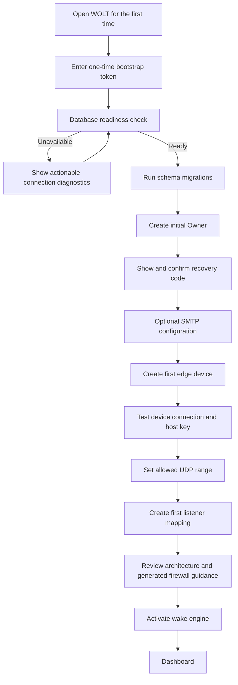
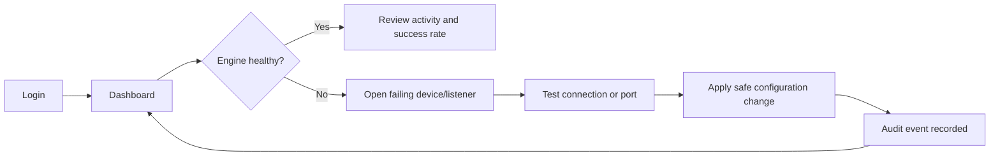
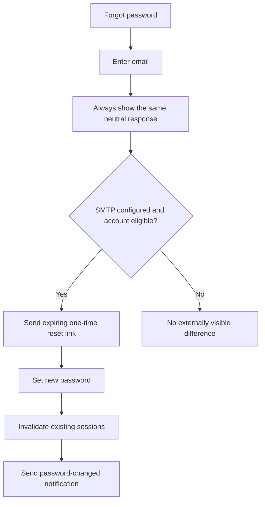

# WOLT Web — Product UX and User Flows

Status: Draft for review — no implementation commitment

## Product intent

WOLT Web turns the current headless Wake-on-LAN translator into a self-managed
network operations product. An administrator should be able to install it,
finish a guarded first-run setup, configure edge devices and UDP listeners,
observe wake attempts, and pause or resume packet processing without editing
YAML or entering the container.

The public product language is English by default. The UI is built for i18n
and RTL from the start so Persian can be added without redesigning layouts.

## Primary roles

### Owner

- Created during first-run setup.
- Full access to users, security, database status, SMTP, devices and listeners.
- Cannot reveal stored secrets; can only replace them.

### Administrator

- Manages devices, mappings, engine state, notifications and logs.
- Cannot remove or demote the last Owner.

### Operator

- Views dashboard and events.
- Can test mappings and pause/resume the engine when explicitly permitted.
- Cannot view or change credentials.

### Viewer — later release

- Read-only dashboard and event access.

## Information architecture

```text
WOLT
├── Overview
│   ├── Dashboard
│   └── Architecture guide
├── Wake engine
│   ├── Listener mappings
│   ├── Edge devices
│   └── Engine control
├── Observability
│   ├── Wake events
│   ├── Audit trail
│   └── Notifications
└── Administration
    ├── Users and sessions
    ├── SMTP
    ├── Security and secrets
    ├── Database status
    └── System settings
```

## Global navigation

- Left collapsible sidebar on desktop; drawer on tablet/mobile.
- Top bar contains engine status, theme selector, notifications and user menu.
- Persistent status indicator uses both icon and text, never color alone.
- A global command/search field locates mappings, devices, MAC addresses and
  event IDs.
- Destructive actions require a confirmation dialog naming the affected item.

## First-run flow



Rules:

- Setup cannot be reopened after the first Owner is created.
- SMTP is optional; an offline recovery code is mandatory if SMTP is skipped.
- Device secrets are accepted once, encrypted, and never returned to the UI.
- Database credentials and the master encryption key are bootstrap secrets,
  not ordinary application settings.

## Daily operator flow



## Create-listener flow

1. Select an enabled edge device.
2. Enter a human-readable listener name and optional description.
3. Choose **Auto assign** or enter a UDP port within the allowed range.
4. Enter the device-specific fields. FortiGate v1 requires interface and
   gateway/broadcast IP.
5. Validate formatting, duplicate port, OS bind availability and device
   capability before saving.
6. Save as disabled or **Save and activate**.
7. Show the corresponding Guacamole/PAM values and firewall guidance.

The form is schema-driven by the selected built-in driver. This allows future
devices to add fields without redesigning the whole page, while avoiding a
runtime third-party plugin system in the first web release.

## Pause and resume semantics

- **Pause engine** stops accepting new wake requests and closes UDP sockets.
- The web UI, authentication and event history remain available.
- **Resume engine** validates current mappings and re-binds sockets.
- The UI does not stop or start its own Docker container and never mounts the
  Docker socket.
- Each mapping can also be enabled or disabled independently.

## Recovery flow



An Owner can use the one-time offline recovery code if SMTP is unavailable.
Recovery code regeneration invalidates the previous code and requires recent
reauthentication.

## Empty, loading and error states

- Every table has an intentional empty state with one primary action.
- API failures retain entered form values and provide a correlation ID.
- Device connection errors expose safe categories, not raw credentials or SSH
  session output.
- Loading states use skeletons for cards and tables, not full-screen spinners.
- Engine status is treated as stale if no heartbeat is received within the
  expected interval.

## Key usability decisions awaiting approval

1. English-first with Persian/RTL infrastructure, or bilingual from v0.2?
2. Should Operators be allowed to pause the whole engine?
3. Should deleting a mapping be permanent, or archive-only by default?
4. Is the default UDP range `40000–40099` acceptable for the public release?
5. Should setup require SMTP, or keep it optional with mandatory recovery code?
