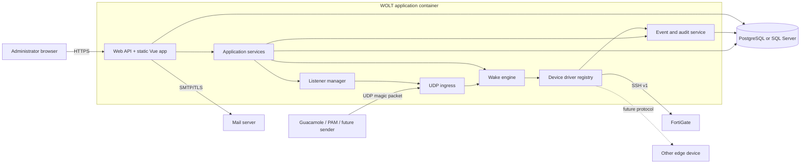
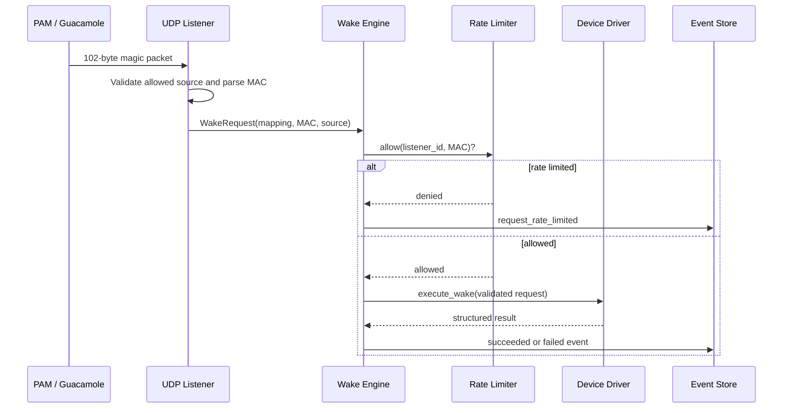
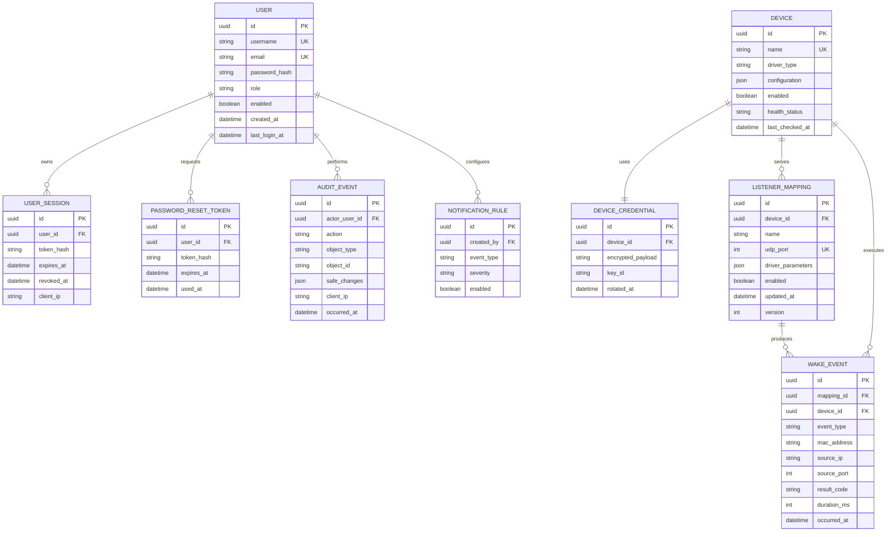

# WOLT Web — Technical Architecture and ERD

Status: Draft for review — modular monolith

## Architectural principles

- Keep one deployable WOLT application, plus an optional local PostgreSQL
  container.
- Preserve the tested parser, command validation and rate limiter as domain
  components.
- Keep infrastructure behind explicit interfaces so drivers and databases do
  not leak into the wake orchestration logic.
- Use an internal HTTP API for the SPA; it is not advertised as a stable public
  integration API in the first web release.
- Do not mount the Docker socket or run the application as root.
- Store operational logs on stdout and structured business/audit events in the
  database.

## Runtime view



## Module boundaries

```text
app/
├── domain/
│   ├── wake.py             # WakeRequest, results and invariants
│   ├── listener.py         # ListenerMapping and port rules
│   ├── device.py           # Device and capability types
│   └── events.py           # Domain event definitions
├── application/
│   ├── wake_service.py     # Orchestration
│   ├── listener_service.py # CRUD and reconcile commands
│   ├── device_service.py   # Connectivity and credential changes
│   └── auth_service.py
├── drivers/
│   ├── base.py             # DeviceDriver protocol
│   └── fortigate_ssh.py    # First built-in driver
├── ingress/
│   └── magic_packet_udp.py
├── infrastructure/
│   ├── database/
│   ├── crypto/
│   ├── email/
│   └── logging/
├── web/
│   ├── api/
│   └── static/             # Compiled Vue assets
└── main.py
```

The exact folders may change during implementation; the dependency direction
must remain `infrastructure/web -> application -> domain`.

## Wake request sequence



## Driver contract

```text
DeviceDriver
├── type_key
├── capabilities()
├── configuration_schema()
├── validate_configuration()
├── test_connection()
└── execute_wake()
```

Drivers are registered by application code in the first web version. Dynamic
installation of arbitrary third-party Python packages is deliberately out of
scope until the security and compatibility model is proven.

## Data ownership



Additional singleton records:

- `application_settings`: allowed UDP range, rate limit, retention and locale.
- `engine_state`: desired state, observed state, heartbeat and last error.
- `smtp_settings`: non-secret fields plus a reference to encrypted credentials.
- `schema_revision`: managed through Alembic rather than application code.

## Database compatibility rules

- PostgreSQL is the reference database and default Quick Start path.
- SQL Server support is introduced only after all ORM models and migrations pass
  a dedicated compatibility suite.
- Avoid vendor-specific JSON queries in core CRUD paths. JSON stores
  driver-specific configuration but frequently filtered fields remain columns.
- IDs are application-generated UUIDs to avoid backend-specific identity rules.
- Store timestamps in UTC and render them in the user's timezone.
- Database switching is an installation choice, not an in-place migration
  feature in v0.2.

## Secret model

```text
User password           -> Argon2id hash; never decryptable
Reset/recovery token    -> hash; single use; expires
Device/SMTP credential  -> authenticated encryption; key ID stored with cipher
Master key              -> Docker secret or protected file outside the database
Database password       -> bootstrap secret outside the target database
```

The UI returns only metadata such as `credential_configured=true`; it never
returns ciphertext or a placeholder that could be mistaken for the real value.

## Port allocation and reconciliation

1. Settings define an application range, initially `40000–40099`.
2. Auto allocation selects the lowest unused allowed port.
3. A transaction and unique constraint prevent concurrent duplicates.
4. Listener Manager attempts the socket bind before reporting active state.
5. Configuration changes create a desired-state revision.
6. Reconciliation closes removed sockets and opens added sockets.
7. Failure keeps the mapping saved but marks it `error`, without stopping other
   listeners.

The container publishes the predetermined install-time range. Changing beyond
that published range requires a Compose/container recreation and is clearly
reported by the UI.

## Logging and retention

- stdout: service lifecycle, unexpected exceptions and safe connection errors.
- `wake_events`: structured request outcomes used by charts and filtering.
- `audit_events`: immutable administrative changes and authentication events.
- Default wake-event retention: 90 days, configurable.
- Audit retention is longer and independently configurable.
- Scheduled cleanup is an in-process maintenance task with advisory locking so
  only one instance performs cleanup.

## Deployment profiles

### Quick Start

```text
wolt-app + wolt-postgres + named volumes
```

### External database

```text
wolt-app -> external PostgreSQL or SQL Server
```

Both profiles use the same WOLT image. The production Vue bundle is served by
the Python web application in v0.2 to keep deployment to one app container.
TLS termination is delegated to an existing reverse proxy; an optional proxy
example can be documented later.

## Non-goals for the first web release

- Runtime installation of third-party driver packages.
- High availability or multiple active UDP worker replicas.
- Automatic host firewall modification.
- Mounting or controlling the Docker socket.
- Seamless live migration between database engines.
- General-purpose workflow automation.

## Architecture decisions recorded for Phase 2

1. The Python application container serves the compiled SPA.
2. PostgreSQL is the only bundled database; SQL Server remains external-only and pending compatibility tests.
3. Wake-event retention defaults to 90 days and audit retention to 365 days.
4. The first web release remains single-instance.
5. MAC-visibility policy remains open until role and event APIs are implemented.
